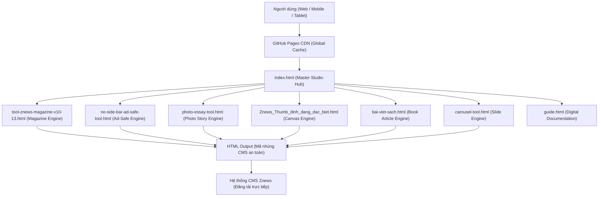

# Kiến trúc kỹ thuật dự án — Znews Editorial Studio

Tài liệu này mô tả chi tiết kiến trúc hệ thống, mô hình thực thi và các quy chuẩn công nghệ của bộ công cụ **Znews Editorial Studio**.

---

## 🏗️ 1. Mô hình kiến trúc tổng quan

Hệ thống được thiết kế theo triết lý **Serverless & 100% Client-Side Architecture** (Toàn bộ logic xử lý diễn ra trực tiếp trên trình duyệt của người dùng).



### Ưu điểm vượt trội của mô hình này:
1. **Bảo mật tuyệt đối**: Dữ liệu bài viết, hình ảnh, văn bản nháp của phóng viên không gửi qua bất kỳ máy chủ trung gian nào. Không có nguy cơ rò rỉ tin tức độc quyền.
2. **Khả dụng vĩnh viễn (Zero Downtime)**: Không có cơ sở dữ liệu (Database) bị sập hay server bị quá tải. Bất kỳ khi nào GitHub Pages hoạt động, công cụ hoạt động.
3. **Chi phí vận hành bằng 0**: Triển khai hoàn toàn miễn phí trên nền tảng GitHub Pages.
4. **Tương thích ngoại tuyến (Offline Ready)**: Có thể tải toàn bộ thư mục về máy tính và mở bằng bất kỳ trình duyệt nào mà không cần kết nối Internet.

---

## 📁 2. Bản đồ cấu trúc dự án (Directory Layout)

```
Công cụ AI Znews/
├── index.html                           # Cổng điều khiển trung tâm (Master Studio Hub)
├── guide.html                           # Cẩm nang quy chuẩn kỹ thuật (Bản HTML trực quan)
├── README.md                            # Tổng quan dự án, hướng dẫn cài đặt & vận hành
├── package.json                         # Manifest quản lý script & cấu hình dự án
├── .gitignore                           # Danh mục tệp bỏ qua khi commit git
├── .editorconfig                        # Cấu hình chuẩn định dạng code giữa các IDE
├── CHANGELOG.md                         # Lịch sử cập nhật các phiên bản
├── CONTRIBUTING.md                      # Hướng dẫn đóng góp & tiêu chuẩn code
├── LICENSE                              # Giấy phép sử dụng nội bộ
│
├── tools/ (Danh mục công cụ độc lập)
│   ├── tool-znews-magazine-v10-13.html  # Công cụ dàn trang Magazine & Longform chuyên sâu
│   ├── no-side-bar-ad-safe-tool.html    # Dựng bài no-sidebar bảo toàn quảng cáo
│   ├── photo-essay-tool.html            # Dựng bài phóng sự ảnh & Photo Story
│   ├── Znews_Thumb_dinh_dang_dac_biet.html # Đóng khung thumbnail 900x600 chuẩn
│   ├── bai-viet-sach.html               # Dựng bài giới thiệu, review sách chuẩn CMS
│   ├── Bai viet sach.html               # Bản gốc bài viết sách (đảm bảo tương thích ngược)
│   └── carousel-tool.html               # Trình tạo khối slide ảnh trình chiếu
│
├── docs/ (Bộ tài liệu kỹ thuật chuyên sâu)
│   ├── ARCHITECTURE.md                  # Kiến trúc hệ thống & Design System (Tệp này)
│   ├── CMS_GUIDELINES.md                # Quy chuẩn kỹ thuật & bố cục CMS (Ad-Safe Standard)
│   ├── TOOL_MANUAL.md                   # Sổ tay hướng dẫn chi tiết 6 công cụ
│   ├── DEVELOPER_GUIDE.md               # Cẩm nang mở rộng, phát triển & deploy
│   └── TROUBLESHOOTING.md               # Hướng dẫn xử lý sự cố & các lỗi thường gặp
│
└── build_guide.py                       # Script tự động đồng bộ tài liệu Markdown sang HTML
```

---

## 🛡️ 3. Chiến lược cách ly CSS (CSS Namespace & Sandboxing)

Một trong những thách thức lớn nhất khi dựng bài đặc biệt trên Znews là **xung đột CSS**:
- CSS của bài viết làm hỏng thanh Header / Menu của Znews.
- Hoặc CSS gốc của Znews ghi đè làm mất màu chữ, kích thước ảnh của bài viết.

### Giải pháp áp dụng:
Mỗi công cụ sinh mã đều đóng gói toàn bộ nội dung và CSS trong một **Namespace duy nhất**:

| Công cụ | Namespace Root Class | Quy tắc định danh con |
|:---|:---|:---|
| **Magazine Generator** | `.znews-magazine-v10` | BEM: `.znm__hero`, `.znm__quote`, `.znm__grid` |
| **No Side-Bar Ad-Safe** | `.ad-safe-container` | BEM: `.ad-safe__bleed`, `.ad-safe__quote` |
| **Photo Essay** | `.znews-photo-essay` | BEM: `.pe__hero`, `.pe__split`, `.pe__caption` |
| **Bài viết sách** | `.container_AI` | BEM: `.cAI__wrap`, `.cAI__intro-note`, `.cAI__quote` |
| **Carousel ảnh** | `.znews-carousel` | BEM: `.zn-carousel__slide`, `.zn-carousel__nav` |

```css
/* Ví dụ mẫu cách ly chuẩn */
.container_AI {
  /* Biến cục bộ, không rò rỉ ra ngoài */
  --ink: #1c2420;
  --accent: #b1502f;
  all: initial; /* Reset thuộc tính kế thừa nếu cần */
  font-family: 'Be Vietnam Pro', sans-serif;
  color: var(--ink);
}
.container_AI * {
  box-sizing: border-box;
}
```

---

## 🎨 4. Design System Cốt Lõi (Znews Brand Tokens)

| Token | Giá trị | Ứng dụng |
|:---|:---|:---|
| `--color-primary` | `#e51c24` | Màu đỏ nhận diện thương hiệu Znews, nút bấm, điểm nhấn |
| `--color-primary-dark` | `#b91c1c` | Trạng thái hover, gradient viền |
| `--color-dark-bg` | `#090d16` | Nền giao diện tối sang trọng (Dark Theme Studio) |
| `--color-dark-surface` | `#141c2e` | Bề mặt card, modal, sidebar |
| `--color-dark-border` | `#23304a` | Đường kẻ viền, phân cách |
| `--color-light-bg` | `#f8fafc` | Nền giao diện sáng (Light Theme) |
| `--color-light-surface`| `#ffffff` | Thẻ card sáng, nền bài viết chuẩn |
| `--font-heading` | `'Be Vietnam Pro', sans-serif` | Tiêu đề giao diện, nút bấm |
| `--font-editorial` | `'Newsreader', Georgia, serif` | Tiêu đề bài viết tạp chí, trích dẫn báo chí |
| `--font-mono` | `'JetBrains Mono', monospace` | Thông số kỹ thuật, mã nguồn, kích thước ảnh |

---

## 🔄 5. Chu trình xử lý dữ liệu trong các công cụ

1. **Input Phase**:
   - Người dùng nhập text, dán mã HTML bài báo cũ hoặc tải file ảnh.
   - Trình phân tích cú pháp (RegExp & DOMParser) bóc tách các thực thể: tiêu đề, đoạn văn, danh sách ảnh, trích dẫn nổi bật.
2. **State Phase**:
   - Trạng thái được lưu trong biến Javascript nội bộ (`state = { title, blocks, options }`).
   - Mọi thay đổi cấu hình (chọn màu, bật hiệu ứng) cập nhật trực tiếp vào State.
3. **Render Phase**:
   - Hàm `renderPreview()` dựng cấu trúc DOM trực quan trong khung xem trước thời gian thực (Live Preview).
4. **Compile Phase**:
   - Hàm `buildOutputCode()` đóng gói CSS độc lập + HTML có gắn namespace.
   - Làm sạch các ký tự đặc biệt, chuẩn hóa khoảng trắng và sao chép vào Clipboard qua API `navigator.clipboard`.
