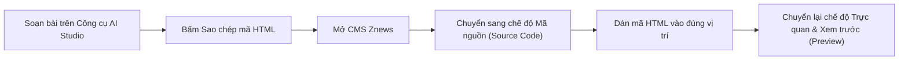

# Sổ tay hướng dẫn sử dụng chi tiết — Znews Editorial Tools

Tài liệu này cung cấp hướng dẫn thao tác chi tiết từng bước cho toàn bộ 6 công cụ trong bộ công cụ **Znews Editorial Studio**. Dành cho Phóng viên, Biên tập viên và Kỹ thuật viên Dàn trang Báo điện tử Znews.

---

## 📑 Mục lục
1. [Znews Magazine Layouts Generator (v10.13)](#1-znews-magazine-layouts-generator-v1013)
2. [Công cụ Dựng bài đặc biệt No Side-bar (Ad-Safe)](#2-công-cụ-dựng-bài-đặc-biệt-no-side-bar-ad-safe)
3. [Công cụ Dựng bài ảnh (Photo Essay)](#3-công-cụ-dựng-bài-ảnh-photo-essay)
4. [Znews Thumb định dạng đặc biệt (900×600)](#4-znews-thumb-định-dạng-đặc-biệt-900600)
5. [Trình tạo bài viết sách (CMS Books)](#5-trình-tạo-bài-viết-sách-cms-books)
6. [Công cụ tạo Carousel ảnh](#6-công-cụ-tạo-carousel-ảnh)
7. [Quy trình chung dán mã vào CMS Znews](#7-quy-trình-chung-dán-mã-vào-cms-znews)

---

## 1. Znews Magazine Layouts Generator (v10.13)
*Tệp tin: `tool-znews-magazine-v10-13.html`*

### 1.1. Mục đích và ứng dụng
- Sử dụng cho các tuyến bài chuyên sâu, Megastory, Longform, Phỏng vấn nhân vật đặc biệt, Tạp chí chuyên đề (Lifestyle, Tech, Xe, Thời trang, Du lịch).
- Tạo trải nghiệm thị giác ấn tượng với hiệu ứng cuộn Parallax mượt mà, sticky banner và typography được cá nhân hóa theo từng chuyên mục.

### 1.2. Các bước thực hiện
1. **Bước 1: Nạp nội dung (Mục 1)**
   - Bạn có thể dán toàn bộ mã nguồn bài viết thô (HTML) vào ô *"Nhập bài từ mã nguồn"*, hệ thống sẽ tự động bóc tách tiêu đề, sapo, các đoạn văn, cụm ảnh và trích dẫn.
   - Hoặc bạn có thể bấm *"Soạn thảo mới"* để tạo từ đầu.
2. **Bước 2: Chọn Kiểu trình bày (Layout Style - Mục 2)**
   - Chọn phong cách bố cục mong muốn: *Hiện đại (Modern), Cổ điển (Classic), Tối giản (Minimalist), Tạp chí công nghệ, Tạp chí phong cách sống...*
3. **Bước 3: Tinh chỉnh Chữ & Màu sắc (Mục 3)**
   - Chọn font chữ tiêu đề (Serif hoặc Sans-Serif chuẩn), cỡ chữ thân bài và khoảng cách dòng (line-height).
   - Chọn bảng màu chủ đạo (Primary Color, Background, Ink). **Khuyến nghị**: Với bài có quảng cáo chạy kèm, nên ưu tiên màu nền mặc định trắng để tránh lỗi thị giác CMS.
4. **Bước 4: Thiết lập Hiệu ứng Cuộn (Mục 4)**
   - Bật/tắt hiệu ứng Parallax ở Hero Image, hiệu ứng xuất hiện chữ (Scroll Reveal) hoặc ghim cố định một cột ảnh (Sticky Side).
5. **Bước 5: Cấu hình Khối Mở đầu (Hero Banner - Mục 5)**
   - Lựa chọn 1 trong các kiểu mở đầu: *Toàn khổ (Fullscreen Hero), Nửa màn hình (Split Screen), Trung tâm (Centered), hoặc Tối giản (Minimal)*.
6. **Bước 6: Xem trước & Xuất mã (Mục 6)**
   - Xem trước giao diện thực tế trên cả giao diện Máy tính (Desktop) và Điện thoại (Mobile).
   - Nhấn nút **"Sao chép mã CMS"** để lưu toàn bộ khối HTML/CSS vào bộ nhớ tạm.

---

## 2. Công cụ Dựng bài đặc biệt No Side-bar (Ad-Safe)
*Tệp tin: `no-side-bar-ad-safe-tool.html`*

### 2.1. Mục đích và ứng dụng
- Dành cho các bài viết định dạng `layout-no-sidebar` (bài đặc biệt có chiều rộng bài 600px nhưng ẩn sidebar quảng cáo).
- **Yêu cầu bắt buộc**: Các banner quảng cáo (đầu trang, giữa bài, cuối bài) **không bao giờ được bị che khuất hoặc lỗi vị trí**.
- Thích hợp cho các bài phân tích sâu, xã luận, bài chuyên đề kinh tế - xã hội.

### 2.2. Điểm đặc thù kỹ thuật
- Tự động nhận diện chuỗi **≥ 3 ảnh liên tiếp** trong bài để đề xuất gộp thành Carousel hoặc Grid ảnh 2-3 cột, giúp bài viết gọn gàng và sinh động.
- Tự động nhận diện trích dẫn nổi bật (Pull-quote) để chèn vào vị trí thích hợp (canh trái, canh phải hoặc tràn viền).
- Sử dụng biến CSS `--img-bleed: calc((100vw - 100%) / 2)` có giới hạn bảo vệ để ảnh mở rộng tràn viền mà không đẩy vỡ khung chứa quảng cáo.

### 2.3. Các bước thực hiện
1. Dán mã nguồn thô của bài vào ô nội dung.
2. Bấm nút **"Phân tích nội dung"**.
3. Xem danh sách các Quote và Chuỗi ảnh mà công cụ bắt được:
   - Tích chọn Quote muốn làm nổi bật và chọn vị trí (Left, Right, Full-width).
   - Chọn chuyển đổi chuỗi ảnh thành dạng Slide vuốt (Carousel) hay dạng Lưới (Grid).
4. Kiểm tra bản xem trước trực tiếp ở khung bên phải.
5. Bấm **"Sao chép mã"** hoặc **"Tải file .html"**.

---

## 3. Công cụ Dựng bài ảnh (Photo Essay)
*Tệp tin: `photo-essay-tool.html`*

### 3.1. Mục đích và ứng dụng
- Dành cho các tuyến bài phóng sự ảnh, chùm ảnh thời sự, ảnh nghệ thuật, lễ hội, thiên nhiên hoặc du lịch.
- Tập trung vào tính trực quan: ảnh cỡ lớn (full-width), ảnh so sánh (Before/After), khối ảnh 2 cột, 3 cột và chú thích ảnh chuẩn phong cách tòa soạn.

### 3.2. Tính năng Chuyển đổi nhanh (1-Click Converter)
- Nếu bạn có một bài ảnh cũ ở định dạng chuẩn CMS thường, chỉ cần dán mã nguồn vào ô *"Chuyển đổi bài ảnh có sẵn"*, công cụ sẽ tự động sắp xếp lại thành layout Photo Essay hiện đại ngay lập tức.

### 3.3. Các bước thực hiện
1. Điền Tiêu đề bài viết, Sapo và chọn Ảnh bìa (Hero Cover Photo).
2. Thêm các phân đoạn ảnh:
   - **Ảnh toàn khổ (Full-width)**: Dành cho ảnh phong cảnh góc rộng, ảnh điểm nhấn chính.
   - **Cụm ảnh đôi / ảnh ba**: Dành cho các góc nhìn liên tiếp của cùng một sự kiện.
   - **Tiêu đề phân đoạn (Section Title)**: Chia bài phóng sự thành các chương/hồi mạch lạc.
3. Điền chú thích cho từng ảnh (ghi rõ nguồn ảnh, tác giả).
4. Nhấn **"Sao chép mã dán vào CMS"**.

---

## 4. Znews Thumb định dạng đặc biệt (900×600)
*Tệp tin: `Znews_Thumb_dinh_dang_dac_biet.html`*

### 4.1. Mục đích và ứng dụng
- Tạo ảnh đại diện hiển thị ngoài trang chủ, trang chuyên mục và khi chia sẻ lên mạng xã hội (Facebook, Zalo, Twitter) cho các tuyến bài định dạng đặc biệt.
- Kích thước chuẩn cố định: **900 × 600 px** (tỷ lệ 3:2).

### 4.2. Các bước thực hiện
1. **Bước 1: Chọn định dạng bài viết**
   - Click chọn loại logo phù hợp: *Photo Essay, Magazine, Minimag, Longform, Special, Cuộc thi, Podcast...*
2. **Bước 2: Tải ảnh lên**
   - Kéo thả file ảnh từ máy tính hoặc bấm chọn tệp. (Ưu tiên ảnh gốc có độ phân giải từ 1200px trở lên).
3. **Bước 3: Chỉnh khung & Vị trí logo**
   - Dùng chuột kéo rê để di chuyển vùng nhìn của ảnh.
   - Dùng thanh trượt phóng to/thu nhỏ (Zoom) để canh góc đẹp nhất.
   - Chọn góc hiển thị logo: Góc trên bên trái, góc dưới bên trái, góc trên bên phải...
4. **Bước 4: Xuất ảnh**
   - Bấm nút **"Xuất ảnh JPG"**. File ảnh với chuẩn 900×600 px và logo đóng sẵn sẽ tự động tải về máy tính của bạn.

---

## 5. Trình tạo bài viết sách (CMS Books)
*Tệp tin: `bai-viet-sach.html` (hoặc `Bai viet sach.html`)*

### 5.1. Mục đích và ứng dụng
- Chuyên biệt cho Chuyên mục Xuất bản, Điểm sách, Trích đoạn sách, Giới thiệu tác giả - tác phẩm của Znews.
- Tự động định dạng các box thông tin sách trực quan: Bìa sách, Tên sách, Tác giả, Nhà xuất bản, Đơn vị phát hành, Năm xuất bản, Trọng lượng/Số trang.
- Tự động thay thế dấu gạch ngang dài (`—`, `–`) bằng dấu phẩy theo đúng quy chuẩn chính tả tiếng Việt của Znews.

### 5.2. Các bước thực hiện
1. Chọn chế độ: **Bài thường** hoặc **Longform**.
2. Thiết lập chế độ sách:
   - Có box sách: Điền tên sách, tác giả, nhà xuất bản, tải ảnh bìa (chọn bìa đứng hoặc bìa ngang).
   - Không có box sách: Sử dụng cho các bài điểm sách tổng hợp nhiều cuốn.
3. Soạn thảo các khối nội dung:
   - Thêm đoạn văn (Leed / Normal).
   - Thêm tiêu đề phụ H3 (tự động có thanh gạch màu trang trí).
   - Thêm hình ảnh trích từ sách kèm chú thích.
   - Thêm khối trích dẫn (Quote) canh trái hoặc phải.
   - Thêm khối thông tin cuối bài (Endnote / Đơn vị xuất bản / Nơi mua sách).
4. Bấm **"Lấy mã HTML"** và copy vào CMS.

---

## 6. Công cụ tạo Carousel ảnh
*Tệp tin: `carousel-tool.html`*

### 6.1. Mục đích và ứng dụng
- Tạo slide ảnh vuốt tương tác nhúng vào giữa bất kỳ bài viết nào để tiết kiệm không gian đọc mà vẫn hiển thị được nhiều ảnh.
- Không cần nạp thêm thư viện bên ngoài (Pure Vanilla JS & CSS), chống xung đột với JS gốc của CMS Znews.

### 6.2. Các bước thực hiện
1. Chọn tỷ lệ hiển thị phù hợp: `16:9` (chuẩn video/ảnh ngang), `4:3`, `3:2` hoặc `1:1` (ảnh vuông).
2. Thêm danh sách ảnh:
   - Nhập URL của từng ảnh (đã tải lên CMS Znews).
   - Nhập chú thích (Caption) riêng cho từng ảnh.
3. Xem trước tương tác trượt ảnh, kiểm tra nút bấm tới/lui và chỉ số trang (Ví dụ: 1/5).
4. Bấm **"Sao chép mã dán vào CMS"**.

---

## 7. Quy trình chung dán mã vào CMS Znews

Để đảm bảo bài viết hiển thị hoàn hảo sau khi xuất mã từ các công cụ:

> [!IMPORTANT]
> **Quy tắc vàng khi dán vào CMS:**
> 1. Luôn chuyển khung soạn thảo của CMS sang chế độ **"Mã nguồn" (Source Code / HTML)** trước khi dán. Tuyệt đối không dán trực tiếp đoạn mã vào chế độ soạn thảo văn bản thông thường (WYSIWYG).
> 2. Sau khi dán, không dùng các công cụ format định dạng mặc định của CMS (như bôi đậm toàn trang, đổi màu chữ gốc) tác động đè lên khối giao diện đã tạo.
> 3. Luôn nhấn nút **Xem trước (Preview)** trên giao diện web và mobile của CMS trước khi xuất bản chính thức.
