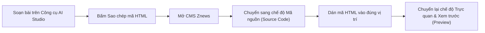

# Sổ tay hướng dẫn sử dụng chi tiết — Znews Editorial Tools

Tài liệu này cung cấp hướng dẫn thao tác chi tiết từng bước cho toàn bộ 8 công cụ trong bộ công cụ **Znews Editorial Studio**. Dành cho Phóng viên, Biên tập viên và Kỹ thuật viên Dàn trang Báo điện tử Znews.

---

## 📑 Mục lục
1. [Znews Magazine Layouts Generator (v10.13)](#1-znews-magazine-layouts-generator-v1013)
2. [Công cụ Dựng bài đặc biệt No Side-bar (Ad-Safe)](#2-công-cụ-dựng-bài-đặc-biệt-no-side-bar-ad-safe)
3. [Công cụ Dựng bài ảnh (Photo Essay)](#3-công-cụ-dựng-bài-ảnh-photo-essay)
4. [Znews Thumb định dạng đặc biệt (900×600)](#4-znews-thumb-định-dạng-đặc-biệt-900600)
5. [Trình tạo bài viết sách (CMS Books)](#5-trình-tạo-bài-viết-sách-cms-books)
6. [Công cụ tạo Carousel ảnh](#6-công-cụ-tạo-carousel-ảnh)
7. [Công cụ dựng bài phỏng vấn (Interview Tool)](#7-công-cụ-dựng-bài-phỏng-vấn-interview-tool)
8. [Công cụ bài so sánh đối chiếu (Comparison Story Tool)](#8-công-cụ-bài-so-sánh-đối-chiếu-comparison-story-tool)
9. [Quy trình chung dán mã vào CMS Znews](#9-quy-trình-chung-dán-mã-vào-cms-znews)

---

## 1. Znews Magazine Layouts Generator (v10.13)
*Tệp tin: `tool-znews-magazine-v10-13.html`*

### 1.1. Mục đích và ứng dụng
- Sử dụng cho các tuyến bài chuyên sâu, Megastory, Longform, Phỏng vấn nhân vật đặc biệt, Tạp chí chuyên đề (Lifestyle, Tech, Xe, Thời trang, Du lịch).
- Tạo trải nghiệm thị giác ấn tượng với hiệu ứng cuộn Parallax mượt mà, sticky banner và typography được cá nhân hóa theo từng chuyên mục.

### 1.2. Các bước thực hiện
1. **Bước 1: Nạp nội dung (Mục 1)**
   - Bạn có thể dán toàn bộ mã nguồn bài viết thô (HTML) vào ô *"Nhập bài từ mã nguồn"*, hệ thống sẽ tự động bóc tách tiêu đề, sapo, các đoạn văn, cụm ảnh và trích dẫn.
   - Hoặc bạn có thể bấm *"Soạn thảo mới"* để tạo từ đầu.
2. **Bước 2: Chọn Kiểu trình bày (Layout Style - Mục 2)**
   - Chọn phong cách bố cục mong muốn: *Hiện đại (Modern), Cổ điển (Classic), Tối giản (Minimalist), Tạp chí công nghệ, Tạp chí phong cách sống...*
3. **Bước 3: Tinh chỉnh Chữ & Màu sắc (Mục 3)**
   - Chọn font chữ tiêu đề (Serif hoặc Sans-Serif chuẩn), cỡ chữ thân bài và khoảng cách dòng (line-height).
   - Chọn bảng màu chủ đạo (Primary Color, Background, Ink). **Khuyến nghị**: Với bài có quảng cáo chạy kèm, nên ưu tiên màu nền mặc định trắng để tránh lỗi thị giác CMS.
4. **Bước 4: Thiết lập Hiệu ứng Cuộn (Mục 4)**
   - Bật/tắt hiệu ứng Parallax ở Hero Image, hiệu ứng xuất hiện chữ (Scroll Reveal) hoặc ghim cố định một cột ảnh (Sticky Side).
5. **Bước 5: Cấu hình Khối Mở đầu (Hero Banner - Mục 5)**
   - Lựa chọn 1 trong các kiểu mở đầu: *Toàn khổ (Fullscreen Hero), Nửa màn hình (Split Screen), Trung tâm (Centered), hoặc Tối giản (Minimal)*.
6. **Bước 6: Xem trước & Xuất mã (Mục 6)**
   - Xem trước giao diện thực tế trên cả giao diện Máy tính (Desktop) và Điện thoại (Mobile).
   - Nhấn nút **"Sao chép mã CMS"** để lưu toàn bộ khối HTML/CSS vào bộ nhớ tạm.

---

## 2. Công cụ Dựng bài đặc biệt No Side-bar (Ad-Safe)
*Tệp tin: `no-side-bar-ad-safe-tool.html`*

### 2.1. Mục đích và ứng dụng
- Dành cho các bài viết định dạng `layout-no-sidebar` (bài đặc biệt có chiều rộng bài 600px nhưng ẩn sidebar quảng cáo).
- **Yêu cầu bắt buộc**: Các banner quảng cáo (đầu trang, giữa bài, cuối bài) **không bao giờ được bị che khuất hoặc lỗi vị trí**.
- Thích hợp cho các bài phân tích sâu, xã luận, bài chuyên đề kinh tế - xã hội.

### 2.2. Điểm đặc thù kỹ thuật
- Tự động nhận diện chuỗi **≥ 3 ảnh liên tiếp** trong bài để đề xuất gộp thành Carousel hoặc Grid ảnh 2-3 cột, giúp bài viết gọn gàng và sinh động.
- Tự động nhận diện trích dẫn nổi bật (Pull-quote) để chèn vào vị trí thích hợp (canh trái, canh phải hoặc tràn viền).
- Sử dụng biến CSS `--img-bleed: calc((100vw - 100%) / 2)` có giới hạn bảo vệ để ảnh mở rộng tràn viền mà không đẩy vỡ khung chứa quảng cáo.

### 2.3. Các bước thực hiện
1. Dán mã nguồn thô của bài vào ô nội dung.
2. Bấm nút **"Phân tích nội dung"**.
3. Xem danh sách các Quote và Chuỗi ảnh mà công cụ bắt được:
   - Tích chọn Quote muốn làm nổi bật và chọn vị trí (Left, Right, Full-width).
   - Chọn chuyển đổi chuỗi ảnh thành dạng Slide vuốt (Carousel) hay dạng Lưới (Grid).
4. Kiểm tra bản xem trước trực tiếp ở khung bên phải.
5. Bấm **"Sao chép mã"** hoặc **"Tải file .html"**.

---

## 3. Công cụ dựng bài ảnh (Photo Essay v3)
*Tệp tin: `photo-essay-tool.html` (hoặc `photo-essay-tool_ver_3.html`)*

### 3.1. Mục đích và ứng dụng
- Dành cho các tuyến bài phóng sự ảnh, chùm ảnh thời sự, ảnh nghệ thuật, lễ hội, thiên nhiên hoặc du lịch.
- Tập trung vào tính trực quan: ảnh cỡ lớn (full-width), ảnh so sánh (Before/After), khối ảnh 2 cột, 3 cột và chú thích ảnh chuẩn phong cách tòa soạn.

### 3.2. Điểm mới nổi bật trên bản 3.0 (v3)
- **Thang phân giải thích ứng thông minh (Responsive Image Ladder)**: Tích hợp hàm `zpPick`, `zpSized` và `zpFixSize` với thang nấc [360, 480, 660, 860, 960, 1024, 1200, 1920]. Tự động phát hiện nếu CMS phục vụ ảnh thumbnail nhỏ (như `w210`) và tự động nâng cấp lên kích thước sắc nét đúng bằng độ phân giải màn hình thật (nhân với devicePixelRatio).
- **Cơ chế chống méo tỷ lệ ảnh (Ratio Drift Guard - `zpCheckRatio`)**: Kiểm tra độ lệch tỷ lệ giữa ảnh thực tế và kích thước khai báo. Nếu phát hiện lệch trên 5%, hệ thống tự động gắn tham số bảo vệ `zpv={w}x{h}` hoặc lấy lại ảnh gốc để giữ nguyên khung hình, không bị co kéo dị dạng.
- **Lightbox zoom siêu nét (High-Res Lightbox)**: Khi phóng to ảnh trong Lightbox, công cụ tự động tính toán và tải ảnh có độ phân giải cao nhất (từ 1024px đến 1920px), đảm bảo xem ảnh trên màn hình lớn hoặc Retina cực kỳ sắc sảo.
- **Fallback đa tầng (`data-zp-orig`)**: Ghi nhớ đường dẫn ảnh gốc nguyên bản, tự động chuyển về ảnh gốc nếu các link CDN tỷ lệ co giãn gặp sự cố.
- **Tự động đồng bộ breadcrumb chuyên mục**: Tự động nhận diện danh mục chính thức của bài viết từ CMS Znews ở cả đầu bài và khối điều hướng chân trang (`zp-endnav`), không cần nhập thủ công.

### 3.3. Các bước thực hiện
1. Điền tiêu đề bài viết, sapo và chọn ảnh bìa (Hero cover photo).
2. Thêm các phân đoạn ảnh:
   - **Ảnh toàn khổ (Full-width)**: Dành cho ảnh phong cảnh góc rộng, ảnh điểm nhấn chính.
   - **Cụm ảnh đôi / ảnh ba**: Dành cho các góc nhìn liên tiếp của cùng một sự kiện.
   - **Tiêu đề phân đoạn (Section title)**: Chia bài phóng sự thành các chương/hồi mạch lạc.
3. Điền chú thích cho từng ảnh (ghi rõ nguồn ảnh, tác giả).
4. Nhấn **"Sao chép mã dán vào CMS"**.

---

## 4. Znews Thumb định dạng đặc biệt (900×600)
*Tệp tin: `Znews_Thumb_dinh_dang_dac_biet.html`*

### 4.1. Mục đích và ứng dụng
- Tạo ảnh đại diện hiển thị ngoài trang chủ, trang chuyên mục và khi chia sẻ lên mạng xã hội (Facebook, Zalo, Twitter) cho các tuyến bài định dạng đặc biệt.
- Kích thước chuẩn cố định: **900 × 600 px** (tỷ lệ 3:2).

### 4.2. Các bước thực hiện
1. **Bước 1: Chọn định dạng bài viết**
   - Click chọn loại logo phù hợp: *Photo Essay, Magazine, Minimag, Longform, Special, Cuộc thi, Podcast...*
2. **Bước 2: Tải ảnh lên**
   - Kéo thả file ảnh từ máy tính hoặc bấm chọn tệp. (Ưu tiên ảnh gốc có độ phân giải từ 1200px trở lên).
3. **Bước 3: Chỉnh khung & Vị trí logo**
   - Dùng chuột kéo rê để di chuyển vùng nhìn của ảnh.
   - Dùng thanh trượt phóng to/thu nhỏ (Zoom) để canh góc đẹp nhất.
   - Chọn góc hiển thị logo: Góc trên bên trái, góc dưới bên trái, góc trên bên phải...
4. **Bước 4: Xuất ảnh**
   - Bấm nút **"Xuất ảnh JPG"**. File ảnh với chuẩn 900×600 px và logo đóng sẵn sẽ tự động tải về máy tính của bạn.

---

## 5. Trình tạo bài viết sách (CMS Books)
*Tệp tin: `bai-viet-sach.html` (hoặc `Bai viet sach.html`)*

### 5.1. Mục đích và ứng dụng
- Chuyên biệt cho Chuyên mục Xuất bản, Điểm sách, Trích đoạn sách, Giới thiệu tác giả - tác phẩm của Znews.
- Tự động định dạng các box thông tin sách trực quan: Bìa sách, Tên sách, Tác giả, Nhà xuất bản, Đơn vị phát hành, Năm xuất bản, Trọng lượng/Số trang.
- Tự động thay thế dấu gạch ngang dài (`—`, `–`) bằng dấu phẩy theo đúng quy chuẩn chính tả tiếng Việt của Znews.

### 5.2. Các bước thực hiện
1. Chọn chế độ: **Bài thường** hoặc **Longform**.
2. Thiết lập chế độ sách:
   - Có box sách: Điền tên sách, tác giả, nhà xuất bản, tải ảnh bìa (chọn bìa đứng hoặc bìa ngang).
   - Không có box sách: Sử dụng cho các bài điểm sách tổng hợp nhiều cuốn.
3. Soạn thảo các khối nội dung:
   - Thêm đoạn văn (Leed / Normal).
   - Thêm tiêu đề phụ H3 (tự động có thanh gạch màu trang trí).
   - Thêm hình ảnh trích từ sách kèm chú thích.
   - Thêm khối trích dẫn (Quote) canh trái hoặc phải.
   - Thêm khối thông tin cuối bài (Endnote / Đơn vị xuất bản / Nơi mua sách).
4. Bấm **"Lấy mã HTML"** và copy vào CMS.

---

## 6. Công cụ tạo Carousel ảnh
*Tệp tin: `carousel-tool.html`*

### 6.1. Mục đích và ứng dụng
- Tạo slide ảnh vuốt tương tác nhúng vào giữa bất kỳ bài viết nào để tiết kiệm không gian đọc mà vẫn hiển thị được nhiều ảnh.
- Không cần nạp thêm thư viện bên ngoài (Pure Vanilla JS & CSS), chống xung đột với JS gốc của CMS Znews.

### 6.2. Các bước thực hiện
1. Chọn tỷ lệ hiển thị phù hợp: `16:9` (chuẩn video/ảnh ngang), `4:3`, `3:2` hoặc `1:1` (ảnh vuông).
2. Thêm danh sách ảnh:
   - Nhập URL của từng ảnh (đã tải lên CMS Znews).
   - Nhập chú thích (Caption) riêng cho từng ảnh.
3. Xem trước tương tác trượt ảnh, kiểm tra nút bấm tới/lui và chỉ số trang (Ví dụ: 1/5).
4. Bấm **"Sao chép mã dán vào CMS"**.

---

## 7. Công cụ dựng bài phỏng vấn (Interview Tool)
*Tệp tin: `interview-tool.html`*

### 7.1. Mục đích và ứng dụng
- Chuyên biệt cho các bài phỏng vấn, tọa đàm chuyên sâu, giao lưu trực tuyến với chuyên gia, nhà khoa học, nhân vật có tầm ảnh hưởng.
- Cung cấp 2 kiểu bố cục hỏi–đáp:
  - **1 cột kinh điển**: Câu hỏi mang màu nhấn đặt phía trên câu trả lời, phù hợp bài dài, nhiều phần.
  - **2 cột cố định (Sticky 2-column)**: Câu hỏi đánh số ở cột trái và đứng yên khi cuộn qua câu trả lời dài, phù hợp bài từ 5–8 câu hỏi đắt giá.
- Tự động đánh số các phần, tạo mục lục điều hướng nhanh (TOC) khi bài có từ 2 phần, tích hợp dải số liệu (Stats band), trích dẫn nổi bật và thông điệp kết bài.

### 7.2. Điểm đặc thù kỹ thuật & xử lý lỗi tràn viền (Bleed fix)
- **Tự động thích ứng bố cục đặc biệt CMS (`layout-special`)**: Khắc phục triệt để lỗi khi bài phỏng vấn đặt ở bố cục `layout-special` (toàn màn hình, chiều rộng 100vw ~ 1629px) bị margin âm `--bleed: 130px` đẩy 7 phần tử ra ngoài mép màn hình (-130px), dẫn tới tít bị cắt mất chữ đầu và ảnh dạt mép.
  - Tự động đặt `--bleed: 0px` trên mọi giao diện `layout-special` và `mode-bleed`, triệt tiêu 100% lỗi tràn mép.
  - Tự động căn giữa chữ và giới hạn độ rộng đọc tối ưu (`max-width: 760px; margin-inline: auto; padding-inline: 16px;`) cho dẫn nhập, hỏi đáp, trích dẫn và mục lục, giúp bài viết trên màn hình máy tính lớn hiển thị hài hòa, không bị kéo dãn sát mép trái.
  - Xuất trực tiếp thẻ `<article class="zac mode-bleed" id="zacInterview">` không phụ thuộc script `zacWake`, đảm bảo tương thích 100% ngay cả khi CMS lọc bỏ script.
- **Tự động tối ưu độ phân giải ảnh CMS**: Tích hợp nấc thang phân giải `ziPick` từ 360 đến 1920px cho ảnh Znews CDN.

### 7.3. Các bước thực hiện
1. Điền thông tin nhân vật: tên gắn trên tít, chức danh, tiêu đề cuộc trò chuyện, sapo (tối đa 2 câu) và ảnh chân dung.
2. Soạn đoạn dẫn nhập (mở đầu bằng *Tri Thức - Znews*).
3. Thêm các phần và câu hỏi–đáp:
   - Đặt tiêu đề phần.
   - Nhập nội dung câu hỏi và câu trả lời.
   - Tùy chọn chèn sau câu trả lời: trích dẫn nổi bật, ảnh chụp hoặc dải số liệu (2, 3 hoặc 4 cột).
4. Thiết lập trình bày:
   - Chọn kiểu hỏi–đáp (1 cột hoặc 2 cột).
   - Chọn bố cục (No side-bar an toàn quảng cáo hoặc Tràn viền toàn màn hình).
   - Chọn màu nhấn (Đỏ, Xanh dương, Xanh lá, Đen).
5. Kiểm tra danh sách checklist ở mục kiểm tra trước khi xuất.
6. Bấm **"Sao chép mã"** hoặc **"Tải file .html"**.

---

## 8. Công cụ bài so sánh đối chiếu (Comparison Story Tool)
*Tệp tin: `comparison-tool.html`*

### 8.1. Mục đích và ứng dụng
- Dành cho các tuyến bài so sánh đa chiều, phân tích đối lập, trước và sau (Before & After), sự đánh đổi và lợi ích (Trade-off & Benefit), hoặc so sánh hai phương án lựa chọn A và B.
- Mỗi bài viết được tổ chức thành nhiều mục nhỏ (sections). Mỗi mục nhỏ gồm một khối media tương tác và một ma trận văn bản 2 cột cân đối.
- Giữ được sự cân bằng thị giác hoàn hảo ngay cả khi nội dung phân tích rất dài (từ 1 đến 2–3 đoạn văn chi tiết cho mỗi bên).

### 8.2. Điểm đặc thù kỹ thuật & thiết kế tương tác
- **Cơ chế ẩn hiện triệt để hai vế (Exclusive View Switching)**:
  - Khi đang ở góc nhìn "Đánh đổi", toàn bộ phần "Lợi ích" bị ẩn hoàn toàn (100%), và ngược lại. Nhờ đó, hành động trượt mở mang ý nghĩa trực quan và rõ ràng nhất.
- **Tích hợp caption và văn bản phân tích liền khối với ảnh**:
  - Khung nội dung tích hợp (Integrated Visual Frame) đặt ảnh sắc nét và cột nội dung phân tích (1 đến 2–3 đoạn văn bản) trong cùng một khối thẻ thống nhất, có badge nhận diện và màu nhấn đồng bộ.
  - Bố cục 2 cột (Ảnh 55% - Chữ 45%) trên máy tính và tự động xếp chồng trên di động, giữ tỷ lệ thị giác cân xứng hoàn hảo cho các bài viết dài.
- **Thanh trượt chuyển cảnh phong cách iPhone**:
  - Rãnh trượt với dòng chữ phát sáng nhấp nháy: *"Trượt để xem lợi ích ›››"* khi ở bên Đánh đổi, và *"‹‹‹ Trượt để xem đánh đổi"* khi ở bên Lợi ích.
  - Người đọc có thể kéo núm tròn từ bên này sang bên kia, bấm nút tab nhanh, bấm vào rãnh trượt hoặc vuốt (swipe) trực tiếp trên khung nội dung để đổi góc nhìn.
- **Loại bỏ vạch chia cắt ảnh thừa trên ảnh**:
  - Không có vạch chia cắt đôi hay biểu tượng thừa trên bề mặt bức ảnh; ảnh hiển thị trọn vẹn 100%, rõ nét và đúng tỷ lệ.
- **Tương thích toàn diện CMS Znews & an toàn quảng cáo**:
  - Tích hợp namespace độc lập `.zac#zacCompare` ngăn ngừa xung đột CSS toàn trang.
  - Tự động đặt lại `--zc-bleed: 0px` trên giao diện `layout-special` và `mode-bleed`, triệt tiêu hoàn toàn lỗi tràn mép 130px.
  - Tự động nâng cấp thang phân giải ảnh sắc nét `zcFixSize` (từ 360 đến 1920px) cho ảnh Znews CDN.
  - Tự động lấy breadcrumb chuyên mục từ CMS và giữ nguyên định dạng khi dán mã nguồn.

### 8.3. Các bước thực hiện
1. **Bước 1: Thiết lập thông tin chung**
   - Điền tiêu đề bài viết, sapo, tác giả, ngày xuất bản và mở đầu bài (dẫn nhập).
   - Đặt nhãn mặc định cho hai phía: ví dụ "Đánh đổi" (phía A) và "Lợi ích" (phía B), hoặc "Trước" và "Sau", "Phương án A" và "Phương án B".
   - Chọn bộ màu sắc: *Hổ phách – Ngọc lục bảo (Amber & Emerald), Đỏ – Xanh dương, Hoa hồng – Mòng két, hoặc Xám đá – Chàm*.
   - Chọn tỷ lệ khung hình ảnh: `16:9`, `3:2`, `4:3` hoặc `1:1`.
   - Chọn chế độ hiển thị: *An toàn quảng cáo (khung đọc 760px / ảnh 960px)* hoặc *Tràn viền màn hình (Full-width bleed)*.
2. **Bước 2: Soạn thảo các mục so sánh chi tiết**
   - Thêm từng mục so sánh nhỏ: nhập tiêu đề mục (ví dụ: *Chi phí tài chính và tích lũy*, *Chất lượng sống và thời gian di chuyển*...).
   - Nhập ảnh phía A và ảnh phía B (hỗ trợ dán đường dẫn trực tiếp hoặc dán mã ảnh CMS Znews).
   - Nhập nội dung văn bản cho từng phía: có thể nhập nhiều đoạn văn, hệ thống sẽ tự động định dạng và cân đối 2 cột.
   - Thêm nhãn gợi ý hành động vuốt trượt cho từng mục nếu muốn tùy biến lời nhắc.
3. **Bước 3: Nhập kết luận và kiểm tra**
   - Soạn thông điệp tổng kết hoặc lời khuyên ở khối kết bài.
   - Kiểm tra tương tác trượt, nhấn tab và độ cân đối văn bản ở khung xem trước bên phải.
   - Đối chiếu danh sách kiểm tra (checklist) ở chân bảng điều khiển.
4. **Bước 4: Xuất mã nhúng**
   - Bấm **"Sao chép mã"** để lưu mã nguồn HTML/CSS vào clipboard, hoặc bấm **"Tải file .html"** để lưu trữ.

> [!TIP]
> **Bài viết demo mẫu để kiểm tra:**
> Bạn có thể mở trực tiếp tệp [`demo-bai-viet-so-sanh.html`](../demo-bai-viet-so-sanh.html) để trải nghiệm bài viết hoàn chỉnh *"Bỏ phố về ven: Đánh đổi và Lợi ích sau 3 năm nhìn lại"*, thử nghiệm trượt ảnh kiểu iPhone, chuyển chế độ màn hình (Desktop/Mobile/CMS) và sao chép mã nguồn mẫu.

---

## 9. Quy trình chung dán mã vào CMS Znews

Để đảm bảo bài viết hiển thị hoàn hảo sau khi xuất mã từ các công cụ:

```mermaid
flowchart LR
    A["Soạn bài trên Công cụ AI Studio"] --> B["Bấm Sao chép mã HTML"]
    B --> C["Mở CMS Znews"]
    C --> D["Chuyển sang chế độ Mã nguồn (Source Code)"]
    D --> E["Dán mã HTML vào đúng vị trí"]
    E --> F["Chuyển lại chế độ Trực quan & Xem trước (Preview)"]
```

> [!IMPORTANT]
> **Quy tắc vàng khi dán vào CMS:**
> 1. Luôn chuyển khung soạn thảo của CMS sang chế độ **"Mã nguồn" (Source Code / HTML)** trước khi dán. Tuyệt đối không dán trực tiếp đoạn mã vào chế độ soạn thảo văn bản thông thường (WYSIWYG).
> 2. Sau khi dán, không dùng các công cụ format định dạng mặc định của CMS (như bôi đậm toàn trang, đổi màu chữ gốc) tác động đè lên khối giao diện đã tạo.
> 3. Luôn nhấn nút **Xem trước (Preview)** trên giao diện web và mobile của CMS trước khi xuất bản chính thức.
